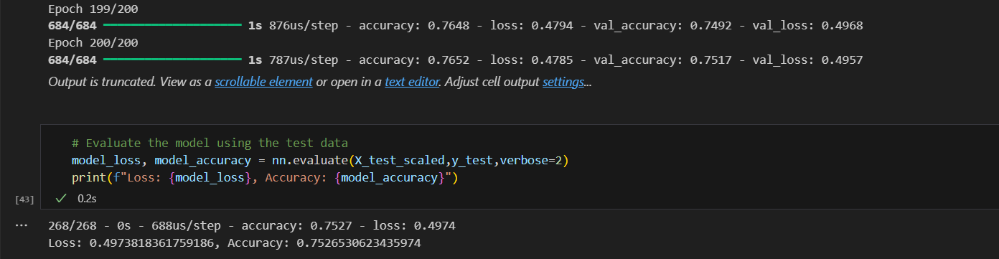

# AlphabetSoupCharity Deep Learning Challenge

## Report

### Overview

The purpose of this analysis is to develop a machine learning model capable of predicting the success of funding applicants for Alphabet Soup, a non-profit foundation. By leveraging neural networks, the goal is to create a binary classifier that can determine whether applicants will be successful if funded. This tool aims to help Alphabet Soup make data-driven decisions in selecting applicants, thereby maximizing the impact of their funding efforts.

The source dataset includes over 34,000 organizations that have received funding from Alphabet Soup.

### Results

#### Data Preprocessing

- **Target Variable:** The target variable for the model is IS_SUCCESSFUL, which indicates whether the money was used effectively.
- **Feature Variables:** The feature variables include APPLICATION_TYPE, AFFILIATION, CLASSIFICATION, USE_CASE, ORGANIZATION, STATUS, INCOME_AMT, SPECIAL_CONSIDERATIONS, and ASK_AMT.
- **Removed Variables:** The EIN and NAME columns were removed as they are identification columns and do not contribute to the predictive power of the model.

#### Compiling, Training, and Evaluating the Model
 
- **Neural network model:** The neural network model was designed with multiple layers. The initial model included:
   - input layer with nodes equal to the number of features
   - 2 hidden layers with `relu` activation functions
   - output layer with `sigmoid` activation function to output a binary result.
- **Target model performance:**
  The initial model achieved an accuracy of approximately 72%. After several optimization attempts, including adjusting the number of neurons and layers, and trying different activation functions, the optimized model achieved the following performance:
  - Accuracy: 0.7526530623435974
  - Loss: 0.4973818361759186
- **Optimization Attempts:**
  - Working with data - include `NAME` to the feature variables
  - Increased the number of neurons in hidden layers - from **30** to **84**
  - Added more hidden layers - increased a number of hidden layers from **2** to **5**
  - Used different activation functions - `relu`, `tanh`, `linear`
  - Used different optimizers - `adam`, `sgd`, `rmsprop`. `rmsprop` turned out to be the most efficient optimizer based on the results of three training sessions. The main difference between `rmsprop` and `sgd` is that rmsprop uses adaptive learning rates for each weight. `adam` utilizes a larger number of mathematical criteria to find the global minimum and will likely perform best in this task with finer tuning of each parameter.
  - Modified the number of epochs to improve training - from `100` to `200`

   **The final optimized configration is:**
   1. Using `NAME` as one of the feature variables
   2. 5 hidden layers:
      - input: units=7, activation='relu'
      - second: units=14, activation='relu'
      - third: units=21, activation='tanh'
      - fourth: units=21, activation='linear'
      - fifth: units=28, activation='relu'
      - output: units=1, activation='sigmoid'
   3. Optimizer: 'sgd'
   4. Number of epochs: **200**



### Summary

The deep learning model developed for Alphabet Soup aims to predict the success of funding applicants. Although the target accuracy of 75% was achieved, the model provides a significant starting point for further enhancements. The following recommendations could help improve the model's performance:

- **Data Enrichment:** Incorporate additional data features that could provide more insights into the success factors.
- **Advanced Algorithms:** Experiment with more advanced machine learning algorithms such as Random Forest or Gradient Boosting.
- **Hyperparameter Tuning:** Implement a systematic hyperparameter tuning approach using tools like GridSearchCV or Bayesian Optimization.

These steps could potentially increase the predictive accuracy and make the model a valuable tool for Alphabet Soup's funding decisions.

## Installation

To run these notebooks, you will need the following dependencies:

- Python 3.x
- Jupyter Notebook
- NumPy
- Pandas
- TensorFlow (or Keras)
- Scikit-learn

## Usage

**1. AlphabetSoupCharity.ipynb**

This notebook includes the steps for data preprocessing and initial model training:

  - Data Preprocessing
  - Read the dataset
  - Identify target and feature variables
  - Drop unnecessary columns
  - Encode categorical variables
  - Split data into training and testing sets
  - Scale the data
  - Model Training
  - Create a neural network model
  - Compile, train, and evaluate the model

To run this notebook, open it in Jupyter Notebook and execute all the cells.

**2. AlphabetSoupCharity_Optimization.ipynb**

This notebook focuses on model optimization and performance analysis:

  - Data Preprocessing (repeated from the first notebook)
  - Model Optimization
  - Adjusting the number of neurons and layers
  - Trying different activation functions
  - Tuning the training process with callbacks and epochs

To run this notebook, open it in Jupyter Notebook and execute all the cells.

## Installation

1. Clone the repository to your local machine:

   ```
   [git clone https://github.com/NataliiaShevchenko620/deep-learning-challenge.git](https://github.com/NataliiaShevchenko620/deep-learning-challenge.git)
   ```

2. Install the required Python libraries
3. Run the notebook or open notebook in the Google collab and run it

## License

This project is licensed under the MIT License.